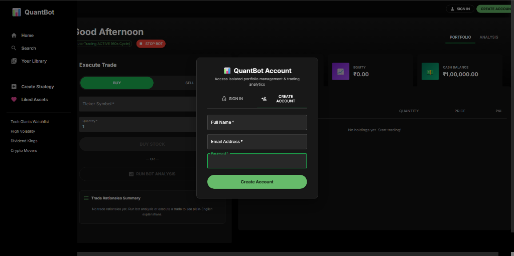

# Quant Trading App 📈

A modern, high-performance quantitative trading platform built with **React**, **FastAPI**, **SQLAlchemy**, and **Supabase PostgreSQL**. Features a Spotify-inspired dark mode UI, native JWT user authentication, parallel 40-company quantitative strategy execution, ATR volatility position sizing, stop-loss protection, plain-English retail trade rationales, and 6–12 month historical backtesting.




---

## ✨ Key Features & Strategy Highlights

### 🔒 User Authentication & Isolated Supabase Portfolios
- **Native JWT Token Authentication**: Secure sign-in and account registration using `bcrypt` password hashing and JSON Web Tokens.
- **Supabase PostgreSQL Integration**: Real-time cloud database connection via Supabase Transaction Pooler (IPv4).
- **Isolated User Portfolios**: Every registered trader gets an isolated portfolio balance (₹100,000 starting cash), position tracking, and personal trade history.
- **Clean Guest State Reset**: Unauthenticated guest users see a clean, zeroed-out template without exposing other users' data.

---

### ⚡ Parallel 40-Company Quantitative Strategy Engine (`SMA5 / SMA20 + RSI14 + ATR14`)
- **Parallel Multi-Threaded Scan**: Scans **ALL 40 top Indian companies** (`INDIAN_STOCKS`) in parallel using a 10-worker thread pool in ~1.8 seconds.
- **Quantitative Momentum Ranking**: Computes $SMA_5$, $SMA_{20}$, $RSI_{14}$, and $ATR_{14}$ for every company and ranks all 40 stocks by Quantitative Momentum Score:
  $$\text{Score} = \frac{SMA_5 - SMA_{20}}{SMA_{20}} \times 100 + (RSI_{14} - 50)$$
- **Multi-Stock Purchase Diversification**: Allocates capital across the top 4 candidate companies (`HCLTECH`, `TCS`, `TITAN`, `ONGC`, `ICICIBANK`, etc.) rather than focusing on a single stock.
- **Automated Stop-Loss Protection**: Emergency monitor checks active positions during every pass. Positions incurring a drawdown of $\ge 3.0\%$ trigger an automated `STOP_LOSS` market sell.
- **Dynamic Retail Trade Rationales**: Generates 1–2 plain-English sentences for every trade explaining the technical indicators without complex jargon.
- **60-Second Auto-Trading Bot Ticker**: Continuous 60-second ticker in the frontend triggers automated market scans and syncs portfolio metrics directly to Supabase.

---

### 📊 Historical Backtesting Engine (6–12 Months)
- Run 6-month or 12-month historical simulations for any NSE stock ticker.
- Interactive **Simulated Equity Curve** vs. Stock Price benchmark chart.
- Key statistical metrics: **Total Return %**, **Max Drawdown %**, **Sharpe Ratio**, **Win Rate %**, and **Total Trades**.

---

### 💼 Portfolio Analytics & Watchlist
- Track **Holdings**, **Total Equity**, **Cash Balance**, and real-time **P&L**.
- Verified 40-stock watchlist including top Indian market leaders (`RELIANCE.NS`, `TCS.NS`, `INFY.NS`, `ICICIBANK.NS`, `HCLTECH.NS`, `TITAN.NS`, `ONGC.NS`, `WIPRO.NS`, `PAYTM.NS`, `IEX.NS`, `BSE.NS`).

---

### 🎨 Premium Dark UI
- Modern Spotify-inspired dark mode UI built with React, Material UI, and Recharts.
- Responsive flex layout with dynamic sidebar drawer navigation and modal overlays.

---

## 🛠️ Tech Stack

- **Frontend**: React, TypeScript, Material UI, Recharts, Vite, Axios
- **Backend**: Python, FastAPI, SQLAlchemy, PostgreSQL (`psycopg2`), Pandas, NumPy, yfinance, Pydantic
- **Database**: Supabase PostgreSQL (IPv4 Transaction Pooler)
- **Data Source**: Yahoo Finance API

---

## 🚀 Installation & Setup

### Prerequisites
- Python 3.9+
- Node.js 16+

---

### 🪟 Windows Setup (PowerShell)

1. **Clone the repository**
   ```powershell
   git clone https://github.com/NotSaM7/quant_trading.git
   cd quant_trading
   ```

2. **Setup & Run Backend**
   ```powershell
   cd backend
   python -m venv .venv
   .\.venv\Scripts\Activate.ps1
   pip install -r requirements.txt
   uvicorn main:app --reload
   ```

3. **Setup & Run Frontend** *(in a new PowerShell window)*
   ```powershell
   cd quant_trading\frontend
   npm install
   npm run dev
   ```

4. **Open Dashboard**
   Navigate to `http://localhost:5173` in your browser.

---

### 🍎 macOS / Linux Setup (Terminal)

1. **Clone the repository**
   ```bash
   git clone https://github.com/NotSaM7/quant_trading.git
   cd quant_trading
   ```

2. **Setup & Run Backend**
   ```bash
   cd backend
   python3 -m venv .venv
   source .venv/bin/activate
   pip install -r requirements.txt
   uvicorn main:app --reload
   ```

3. **Setup & Run Frontend** *(in a new Terminal window)*
   ```bash
   cd quant_trading/frontend
   npm install
   npm run dev
   ```

4. **Open Dashboard**
   Navigate to `http://localhost:5173` in your browser.

---

## 🤝 Contributing

Contributions are welcome! Feel free to submit a Pull Request or open an Issue.
