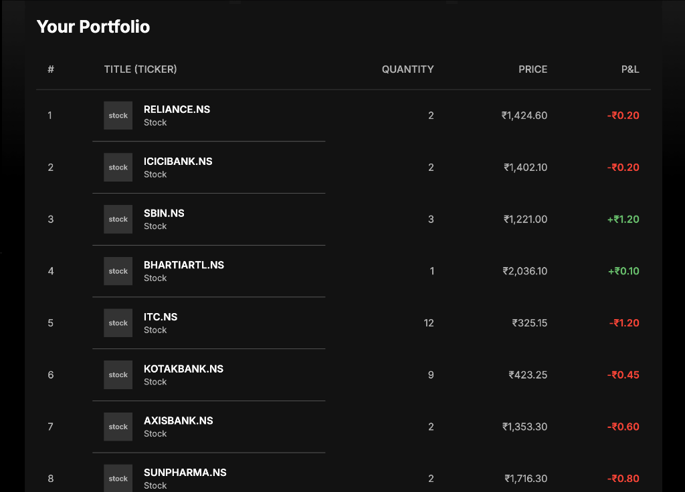
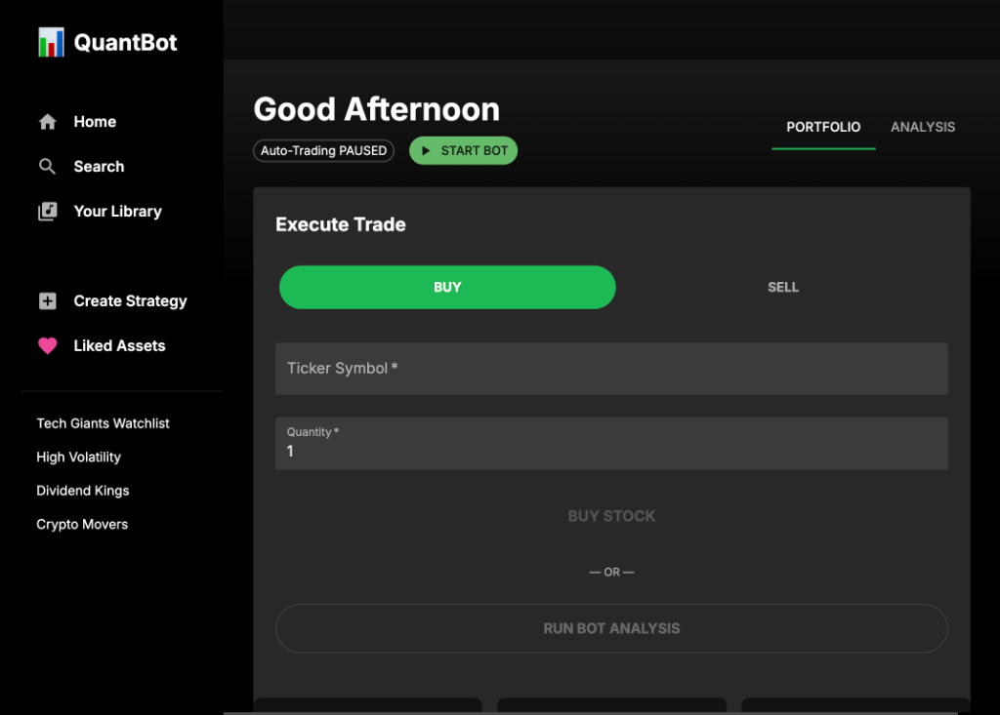

# Quant Trading App 📈

A modern, high-performance quantitative trading platform built with **React**, **FastAPI**, and **Python**. Features a Spotify-inspired dark mode UI, automated algorithmic trading, dynamic ATR position sizing, stop-loss protection, plain-English retail trade rationales, and 6–12 month backtesting.




---

## ✨ Key Features & Strategy Highlights

### 🤖 Algorithmic Strategy Engine (`SMA5 / SMA20 + RSI14 + ATR14`)
- **Dual-Momentum Confirmation Filter**: A BUY signal requires both an $\text{SMA}_5 > \text{SMA}_{20}$ bullish crossover **and** an $\text{RSI}_{14} > 50$ momentum confirmation filter to prevent false breakouts.
- **ATR Volatility Position Sizing**: Orders are sized dynamically using 14-day Average True Range ($\text{ATR}_{14}$) volatility rather than static share amounts, risking no more than 2.0% of portfolio equity per trade.
- **Automated Stop-Loss Protection**: An automated risk monitor checks active holdings during every execution pass. Positions encountering a drawdown of $\ge 3.0\%$ trigger an emergency market `STOP_LOSS` sell order.
- **Dynamic Trade Rationales**: Generates 1–2 short, plain-English sentences for retail investors explaining the technical reason why each stock was purchased or sold without complex jargon.
- **Live Scanning Bot (60s Loop)**: Scans 40 top NSE stocks every 60 seconds with auto-refreshing summary cards on the UI.

---

### 📊 Historical Backtesting Engine (6–12 Months)
- Run 6-month or 12-month historical simulations for any NSE stock ticker.
- Interactive **Simulated Equity Curve** vs. Stock Price benchmark chart.
- Key statistical metrics: **Total Return %**, **Max Drawdown %**, **Sharpe Ratio**, **Win Rate %**, and **Total Trades**.

---

### 💼 Portfolio Analytics & Watchlist
- Track **Holdings**, **Total Equity**, **Cash Balance**, and real-time **P&L**.
- Verified 40-stock watchlist including top Indian market leaders (`RELIANCE.NS`, `TCS.NS`, `INFY.NS`, `TATASTEEL.NS`, `TMPV.NS`, `ETERNAL.NS`, `PAYTM.NS`, `IEX.NS`, `IRCTC.NS`, `BSE.NS`, `CDSL.NS`).

---

### 🎨 Premium Dark UI
- Modern Spotify-inspired dark mode UI built with React, Material UI, and Recharts.
- Responsive flex layout with zero fixed pixel overflows.

---

## 🛠️ Tech Stack

- **Frontend**: React, TypeScript, Material UI, Recharts, Vite
- **Backend**: Python, FastAPI, Pandas, NumPy, yfinance, Pydantic
- **Data Source**: Yahoo Finance API

---

## 🚀 Getting Started

### Prerequisites
- Python 3.9+
- Node.js 16+

### Installation & Setup

1. **Clone the repository**
   ```bash
   git clone https://github.com/NotSaM7/quant_trading.git
   cd quant_trading
   ```

2. **Setup Backend**
   ```bash
   cd backend
   python -m venv .venv
   
   # Windows PowerShell:
   .\.venv\Scripts\Activate.ps1
   # Linux/macOS:
   # source .venv/bin/activate

   pip install -r requirements.txt
   uvicorn main:app --reload
   ```

3. **Setup Frontend**
   ```bash
   cd frontend
   npm install
   npm run dev
   ```

4. **Open Dashboard**
   Navigate to `http://localhost:5173` in your browser.

---

## 🤝 Contributing

Contributions are welcome! Feel free to submit a Pull Request or open an Issue.
