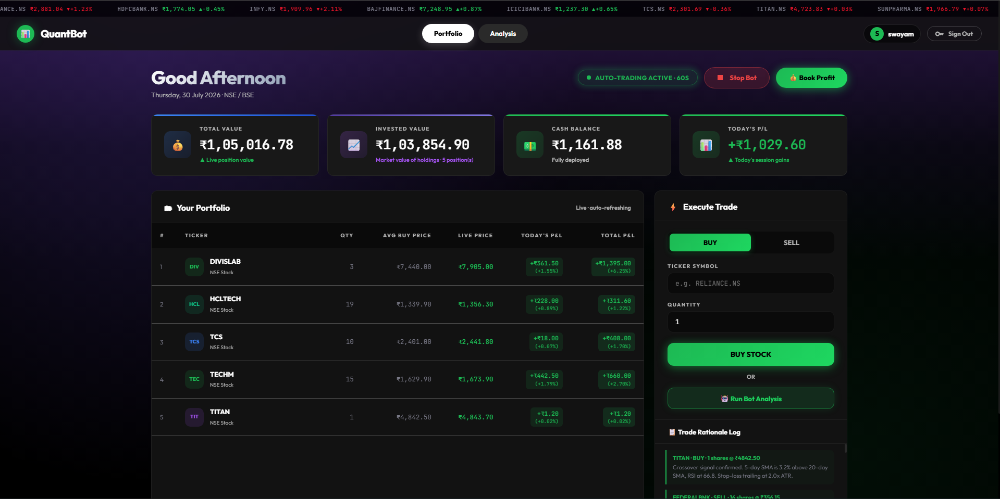
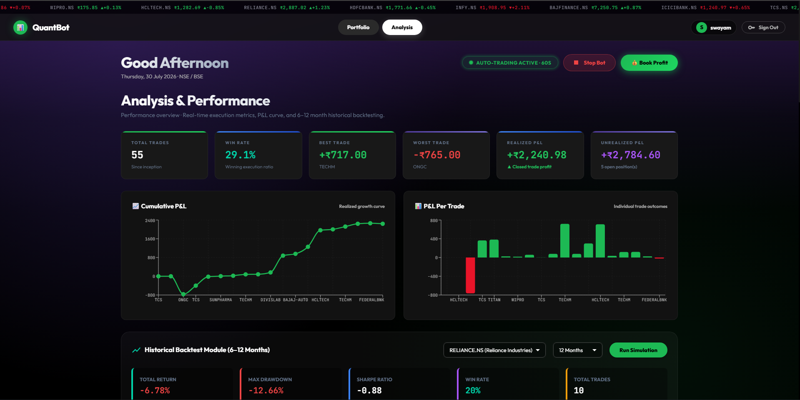
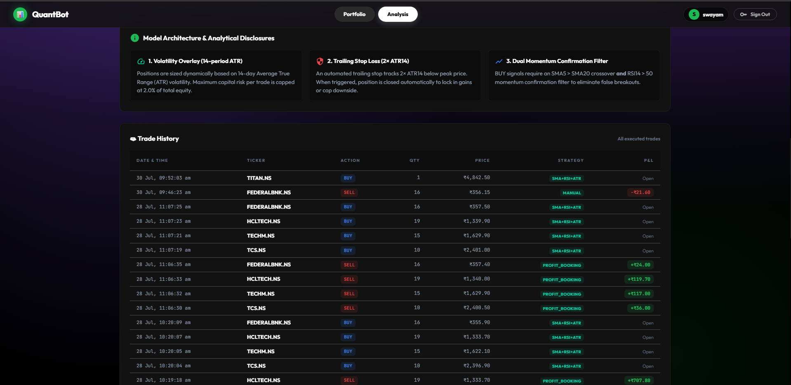

# Quant Trading App 📈 — Premium Trading Dashboard

A modern, high-performance quantitative trading platform built with **React**, **FastAPI**, **SQLAlchemy**, and **Supabase PostgreSQL**. Features a Spotify-inspired dark mode UI, native JWT user authentication, parallel NSE stocks quantitative strategy execution, ATR volatility position sizing, automated 1-click **Book Profit** capital gains cash-out, real-time **Today's P/L** tracking, stop-loss protection, plain-English retail trade rationales, and 6–12 month historical backtesting.





> ℹ️ **Demonstration & Trial Notice**: All screenshots, portfolio figures, stock prices, and P&L metrics displayed above are generated during system trial testing runs for UI demonstration purposes. Values may or may not reflect real live financial data and do not represent guaranteed financial returns or actual monetary transactions.

---

## ✨ Key Features & Strategy Highlights

### 💰 Automated "Book Profit" Capital Gains Cash-Out
- **1-Click Profit Booking**: Evaluates **Total Portfolio Value** against the baseline initial capital (₹100,000).
- **Selective Profit Liquidation**: Identifies and liquidates **100% of all stock positions currently in profit** (`current_price > average_price` or `pnl > 0`) at live market prices.
- **Cash Realization**: Credits principal cost basis + profit directly to your cash balance while keeping non-profitable positions intact for recovery or trailing stop-loss protection.
- **Automated Bot Re-scan**: Instantly re-initiates automated market scanning across Indian stocks (`RELIANCE.NS`, `TCS.NS`, `INFY.NS`, `HCLTECH.NS`, `WIPRO.NS`, `TITAN.NS`) to detect new entry opportunities.

---

### 📊 Live "Today's P/L" Stat Card & Summary Metrics
- **Session P&L Tracking**: Dedicated **TODAY'S P/L** stat card displayed right beside **CASH BALANCE**, color-coded in Spotify Green (`#1DB954`) for session gains or Red (`#E91429`) for session losses.
- **Pure Intraday Metrics**: Calculates realized P&L from trades executed today (since 12:00 AM midnight) plus intraday unrealized position movement, excluding older trades from prior days.
- **Weighted Average Cost Basis (`AVG BUY PRICE`)**: Table columns explicitly calculate the weighted average purchase price across multiple order executions for precise position P&L tracking.

---

### ⚡ Top Live Marquee Ticker & Market Guard System
- **Top Live Ticker Bar**: Continuous smooth scrolling marquee ticker (`@keyframes tickerScroll`) streaming live Indian NSE stock quotes across the top navigation header.
- **5-Second Welcome Overlay Modal**: Smooth startup overlay featuring animated logo badge, IST Market Status badge (`OPEN` / `CLOSED` / `WEEKEND`), 4-cell schedule grid, and 5-second linear progress countdown.
- **Weekend & Off-Hours Market Guard**: Floating warning toast banner (`#mkt-closed-toast`) with backdrop blur (`blur(20px)`), guarding against order execution outside NSE/BSE trading hours (9:15 AM – 3:30 PM IST).

---

### ⚡ Parallel NSE Stocks Quantitative Strategy Engine (`SMA5 / SMA20 + RSI14 + ATR14`)
- **Parallel Multi-Threaded Scan**: Scans **NSE stocks** (`INDIAN_STOCKS`) in parallel using a 10-worker thread pool in ~1.8 seconds.
- **Quantitative Momentum Ranking**: Computes $SMA_5$, $SMA_{20}$, $RSI_{14}$, and $ATR_{14}$ for every company and ranks NSE stocks by Quantitative Momentum Score:
  $$\text{Score} = \frac{SMA_5 - SMA_{20}}{SMA_{20}} \times 100 + (RSI_{14} - 50)$$
- **Multi-Stock Purchase Diversification**: Allocates capital across the top 4 candidate companies rather than focusing on a single stock.
- **Automated Stop-Loss Protection**: Emergency monitor checks active positions during every pass. Positions incurring a drawdown of $\ge 3.0\%$ trigger an automated `STOP_LOSS` market sell.
- **Format 1 Retail Trade Rationales**: Generates 1–2 plain-English sentences for every trade explaining the technical indicator crossovers ($SMA_5$, $SMA_{20}$, $RSI_{14}$, $ATR_{14}$) without complex jargon.
- **60-Second Auto-Trading Bot Ticker**: Continuous 60-second ticker in the frontend triggers automated market scans and syncs portfolio metrics directly to Supabase.

---

### 🔒 User Authentication & Isolated Supabase Portfolios
- **Native JWT Token Authentication**: Secure sign-in and account registration using `bcrypt` password hashing and JSON Web Tokens.
- **Supabase PostgreSQL Integration**: Real-time cloud database connection via Supabase Transaction Pooler (IPv4).
- **Isolated User Portfolios**: Every registered trader gets an isolated portfolio balance (₹100,000 starting cash), position tracking, and personal trade history.

---

### 📊 Historical Backtesting Engine (6–12 Months)
- Run 6-month or 12-month historical simulations for any NSE stock ticker.
- Interactive **Simulated Equity Curve** vs. Stock Price benchmark chart.
- Key statistical metrics: **Total Return %**, **Max Drawdown %**, **Sharpe Ratio**, **Win Rate %**, and **Total Trades**.

---

### 🎨 Premium Dark UI Aesthetic
- Modern Spotify-inspired dark mode UI built with React, Material UI, and Recharts.
- Ambient purple gradient background overlay (`linear-gradient(180deg, rgba(67, 35, 113, 0.6) ...)`), glassmorphic panels (`#121212`), 12px rounded corners, and vibrant electric green button glow effects (`#1ed760`).

---

## 🛠️ Tech Stack

- **Frontend**: React, TypeScript, Material UI, Recharts, Vite, Axios
- **Backend**: Python, FastAPI, SQLAlchemy, PostgreSQL (`psycopg2`), Pandas, NumPy, yfinance, Pydantic
- **Database**: Supabase PostgreSQL (IPv4 Transaction Pooler)
- **Data Source**: Yahoo Finance API

---

## 🚀 Installation & Setup

### Prerequisites
- Python 3.9+
- Node.js 16+

---

### 🪟 Windows Setup (PowerShell)

1. **Clone the repository**
   ```powershell
   git clone https://github.com/NotSaM7/quant_trading.git
   cd quant_trading
   ```

2. **Setup & Run Backend**
   ```powershell
   cd backend
   python -m venv .venv
   .\.venv\Scripts\Activate.ps1
   pip install -r requirements.txt
   uvicorn main:app --reload
   ```

3. **Setup & Run Frontend** *(in a new PowerShell window)*
   ```powershell
   cd quant_trading\frontend
   npm install
   npm run dev
   ```

4. **Open Dashboard**
   Navigate to `http://localhost:5173` in your browser.

---

### 🍎 macOS / Linux Setup (Terminal)

1. **Clone the repository**
   ```bash
   git clone https://github.com/NotSaM7/quant_trading.git
   cd quant_trading
   ```

2. **Setup & Run Backend**
   ```bash
   cd backend
   python3 -m venv .venv
   source .venv/bin/activate
   pip install -r requirements.txt
   uvicorn main:app --reload
   ```

3. **Setup & Run Frontend** *(in a new Terminal window)*
   ```bash
   cd quant_trading/frontend
   npm install
   npm run dev
   ```

4. **Open Dashboard**
   Navigate to `http://localhost:5173` in your browser.

---

## 🤝 Contributing

Contributions are welcome! Feel free to submit a Pull Request or open an Issue.
